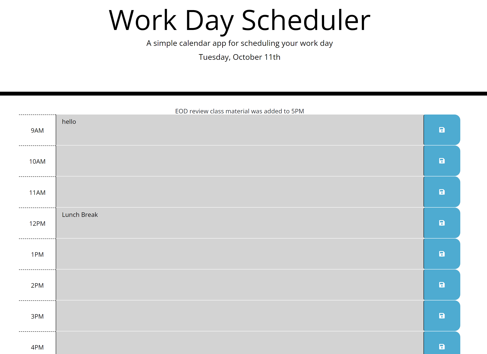

# 05-Work-Day-Scheduler

Single page daily planner web app 

## Description

This website was created as a Daily Planner for standard business hours using HTML, CSS, JavaScript, JavaScript libraries such as Jquery & momentjs a third party API. 
Jquery was used instead of vanilla JS to traverse & manipulatie the DOM, dynamically adding and updating HTML elements within the webpage. Knowledge Objects, local storage & event listeners is also required. Learned a second method besides vanilla js to traverse and manipulate the DOM elements, how to use bootstrap, font awesome, & Jquery. 

## User Story

```md
AS AN employee with a busy schedule
I WANT to add important events to a daily planner
SO THAT I can manage my time effectively
```

## Acceptance Criteria

```md
GIVEN I am using a daily planner to create a schedule
WHEN I open the planner
THEN the current day is displayed at the top of the calendar
WHEN I scroll down
THEN I am presented with timeblocks for standard business hours
WHEN I view the timeblocks for that day
THEN each timeblock is color coded to indicate whether it is in the past, present, or future
WHEN I click into a timeblock
THEN I can enter an event
WHEN I click the save button for that timeblock
THEN the text for that event is saved in local storage
WHEN I refresh the page
THEN the saved events persist
```

## Link

Try it out here: [Work Day Scheduler](https://youssefojeil.github.io/05-Work-Day-Scheduler/)

## Images


